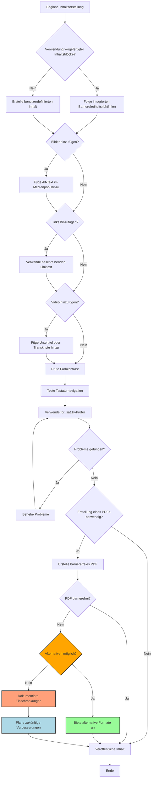

# **REDAXO Barrierefreiheits-Cheatsheet für Redakteur:innen**

## Inhaltsverzeichnis

1. [Kurz und knapp](#kurz-und-knapp)
   1. [Struktur und Semantik](#struktur-und-semantik)
   2. [Bilder und Alternativtexte](#bilder-und-alternativtexte)
   3. [Links und Navigation](#links-und-navigation)
   4. [Farben und Kontraste](#farben-und-kontraste)
   5. [Medieninhalte](#medieninhalte)
   6. [Tastaturzugänglichkeit](#tastaturzugänglichkeit)
   7. [Testen und Überprüfen](#testen-und-überprüfen)
   8. [Barrierefreie PDFs](#barrierefreie-pdfs)
      - [Microsoft Word (Windows/macOS)](#microsoft-word-windowsmacos)
      - [LibreOffice (Windows/macOS/Linux)](#libreoffice-windowsmacoslinux)
      - [PDFs auf Barrierefreiheit prüfen](#pdfs-auf-barrierefreiheit-prüfen)
      - [PDFs in REDAXO einbinden](#pdfs-in-redaxo-einbinden)

2. [Zusätzliche Hinweise zur Barrierefreiheit](#zusätzliche-hinweise-zur-barrierefreiheit)
   1. [Barrierefreiheit ist nicht nur für sehbehinderte Menschen wichtig](#barrierefreiheit-ist-nicht-nur-für-sehbehinderte-menschen-wichtig)
   2. [Leichte und einfache Sprache](#leichte-und-einfache-sprache)
      - [Komplexer Text](#komplexer-text)
      - [Einfache Sprache](#einfache-sprache)
      - [Leichte Sprache](#leichte-sprache)

3. [Möglicher Ablauf](#möglicher-ablauf)
   - [Flussdiagramm: Barrierefreiheit-Arbeitsablauf](#flussdiagramm-barrierefreiheit-arbeitsablauf)

## Kurz und knapp
---

| **Kategorie**                  | **Aktion**                                                                                             | **Schritte / Hinweise**                                                                                                    |
|--------------------------------|--------------------------------------------------------------------------------------------------------|----------------------------------------------------------------------------------------------------------------------------|
| **Struktur und Semantik**       | **Achten Sie bei der Verwendung der vorbereiteten Inhaltsblöcke auf Barrierefreiheitshinweise**        | Ihr REDAXO bietet vorbereitete Inhaltsblöcke. Achten Sie darauf, dass diese Blöcke korrekt verwendet werden und entsprechende Hinweise zur Barrierefreiheit (z.B. Alternativtexte für Bilder, richtige Überschriftenhierarchie) beachtet werden. |
| **Bilder und Alternativtexte**  | **Alt-Texte für Bilder einfügen**                                                                      | 1. Im Medienpool Alt-Texte definieren. 2. Alternativtexte in Modulen wie "Text mit Bild" einfügen.                       |
|                                | **Dekorative Bilder ohne Alt-Text**                                                                    | Setzen Sie für rein dekorative Bilder das Alt-Attribut auf `alt=""`.                                                       |
| **Links und Navigation**        | **Sinnvolle Linktexte verwenden**                                                                      | Vermeiden Sie generische Linktexte wie "Hier klicken". Der Linktext sollte das Ziel klar beschreiben.                       |
|                                | **Sprunglinks hinzufügen**                                                                             | Fügen Sie **Skiplinks** hinzu, damit Nutzer direkt zum Hauptinhalt springen können.                                         |
| **Farben und Kontraste**        | **Hoher Kontrast für Texte**                                                                           | Stellen Sie sicher, dass Text und Hintergrund einen Kontrastwert von mindestens 4.5:1 haben. Verwenden Sie Tools wie WebAIM. |
|                                | **Text und Hintergrundfarben zugänglich gestalten**                                                     | Farben im Modul klar definieren, kontrastreiche Kombinationen verwenden.                                                   |
| **Medieninhalte**               | **Untertitel für Videos hinzufügen**                                                                   | Bei eingebetteten Videos, falls möglich, Untertitel hinzufügen oder separate Transkripte bereitstellen.                    |
| **Tastaturzugänglichkeit**      | **Tab-Reihenfolge prüfen**                                                                             | Überprüfen Sie, dass die Tab-Reihenfolge auf der Seite logisch ist und interaktive Elemente erreichbar sind.                |
|                                | **Fokus-Indikator nicht entfernen**                                                                    | Sichtbare Fokus-Stile sicherstellen, um Tastaturnutzern die Navigation zu erleichtern.                                      |
| **Testen und Überprüfen**       | **Überprüfen Sie Ihre Inhalte im Frontend mit dem Barrierechecker for_sa11y**                          | 1. Öffnen Sie das REDAXO-Frontend. 2. Unten rechts erscheint ein blauer Button mit einer Figur in der Mitte. 3. Klicken Sie auf diesen Button, um den **for_sa11y**-Checker zu öffnen. 4. for_sa11y überprüft die Seite auf Barrierefreiheitsprobleme und hebt diese direkt hervor. |
|                                | **Tastatursteuerung testen**                                                                            | 1. Navigieren Sie durch die Seite nur mit der Tastatur (Tabulator-Taste für Fokus und Enter für Aktionen). 2. Stellen Sie sicher, dass alle interaktiven Elemente (Links, Buttons, Formulare) fokussierbar sind und in logischer Reihenfolge erreicht werden. 3. Überprüfen Sie, ob der Fokus-Stil sichtbar und eindeutig ist. |
|                                | **Manuelle Tests durchführen**                                                                         | Testen Sie Seiten mit Screenreadern (z.B. NVDA, VoiceOver) und nur mit der Tastatur, um die Barrierefreiheit sicherzustellen. |
|                                | **Automatisierte Tests kombinieren**                                                                   | Verwenden Sie for_sa11y zusammen mit anderen Tools wie WAVE oder Lighthouse für eine umfassende Prüfung.                   |
| **Barrierefreie PDFs**          | **Barrierefreie PDFs mit Word und LibreOffice erstellen und prüfen**                                   |                                                                                                                            |
|                                | **Microsoft Word (Windows/macOS)**                                                                     | 1. **Strukturierung des Dokuments**: Verwenden Sie korrekt formatierte Überschriften (H1, H2, H3), Listen und Tabellen. 2. **Alternativtexte**: Fügen Sie Alternativtexte für alle Bilder und Grafiken ein (Rechtsklick auf Bild > "Bild formatieren" > "Alternativtext"). 3. **Barrierefreiheitsprüfung**: Nutzen Sie die integrierte Barrierefreiheitsprüfung (Reiter "Überprüfen" > "Barrierefreiheit überprüfen"), um Fehler zu finden und zu beheben. 4. **PDF exportieren**: Beim Speichern als PDF aktivieren Sie die Option "Barrierefreie PDF erstellen" (Datei > "Speichern unter" > "PDF" > Optionen > "Dokumentstrukturtags für Barrierefreiheit verwenden"). |
|                                | **LibreOffice (Windows/macOS/Linux)**                                                                  | 1. **Strukturierung des Dokuments**: Verwenden Sie die integrierten Formatvorlagen für Überschriften, Listen und Tabellen. 2. **Alternativtexte**: Fügen Sie Alternativtexte für Bilder ein (Rechtsklick auf Bild > "Eigenschaften" > "Alternativtext"). 3. **PDF exportieren**: Exportieren Sie das Dokument als PDF und aktivieren Sie "PDF/A-1a" oder "PDF/A-2a" für Barrierefreiheit (Datei > "Exportieren als" > "PDF" > PDF/A-1a aktivieren). |
| **PDFs auf Barrierefreiheit prüfen** | **Windows**: Nutzen Sie **PDF Accessibility Checker (PAC 3)** (kostenlos). **macOS**: Verwenden Sie **Adobe Acrobat Pro** oder Online-Tools. **Web**: Verwenden Sie **Online-Dienste** wie das **PAVE-Tool** (https://pave-pdf.org).                                                                                                                                                                                                                                           |
|                                | **PDFs in REDAXO einbinden**                                                                            | 1. Laden Sie das PDF in den **Medienpool** hoch. 2. Stellen Sie sicher, dass der Dateiname und der Linktext das Dokument klar beschreiben (z.B. „Barrierefreiheit-Richtlinien.pdf“). |

---

## Zusätzliche Hinweise zur Barrierefreiheit

### **Barrierefreiheit ist nicht nur für sehbehinderte Menschen wichtig**

Barrierefreies Webdesign richtet sich an alle Nutzer:innen, insbesondere an:

- **Menschen mit motorischen Einschränkungen**: Nutzer:innen, die Schwierigkeiten haben, eine Maus oder ein Touchpad zu verwenden, sind auf eine klare Tastaturnavigation angewiesen.
- **Menschen mit kognitiven Beeinträchtigungen**: Sie benötigen einfache Strukturen und klare Inhalte. Der Textaufbau sollte logisch und leicht nachvollziehbar sein.
- **Menschen mit Wahrnehmungsstörungen (z.B. Farbenblindheit, Auditive Verarbeitungsstörungen)**: Diese Nutzer:innen profitieren von klaren Kontrasten, gutem Farbumsatz und Untertiteln oder Transkripten für Videos.

---

### **Leichte und einfache Sprache**

Leichte und einfache Sprache verbessern die Verständlichkeit von Texten. Menschen mit Lernschwierigkeiten, geringen Sprachkenntnissen oder kognitiven Einschränkungen können so besser auf Inhalte zugreifen.

| **Sprache**           | **Beschreibung**                                                                                                                                               | **Beispiel für komplexen Text**                                                                                  | **Alternative in einfacher Sprache**                                                    | **Alternative in leichter Sprache**                                                    |
|-----------------------|-----------------------------------------------------------------------------------------------------------------------------------------------------------------|------------------------------------------------------------------------------------------------------------------|-----------------------------------------------------------------------------------------|----------------------------------------------------------------------------------------|
| **Komplexer Text**     | Normaler Text, der komplexe Sätze und Fachbegriffe enthält.                                                                                                     | "Die Implementierung neuer Features erfordert eine enge Zusammenarbeit zwischen den verschiedenen Fachabteilungen." | "Um neue Funktionen hinzuzufügen, müssen die Fachabteilungen eng zusammenarbeiten."      | "Um neue Funktionen hinzuzufügen, müssen die Abteilungen gut zusammenarbeiten."         |
| **Einfache Sprache**   | Klarer, einfacher Aufbau. Fachbegriffe werden vermieden oder erklärt.                                                                                            | "Es ist essenziell, dass wir in unserem Projektteam eine interdisziplinäre Herangehensweise an den Tag legen."      | "Es ist wichtig, dass das Team aus Fachleuten verschiedener Bereiche gut zusammenarbeitet."| "Es ist wichtig, dass das Team aus Fachleuten gut zusammenarbeitet."                    |
| **Leichte Sprache**    | Sehr kurze Sätze, kein Fachvokabular. Wird häufig auch durch Piktogramme oder Bilder unterstützt. Nur wesentliche Informationen.                                 | "Die strategische Ausrichtung des Unternehmens wird durch eine Vielzahl von Faktoren beeinflusst."                 | "Es gibt viele Gründe, die die Strategie des Unternehmens beeinflussen."                 | "Es gibt viele Gründe, die die Planung der Firma beeinflussen."                         |

## Möglicher Ablauf

